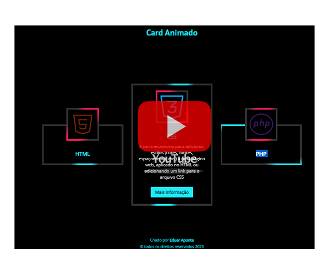
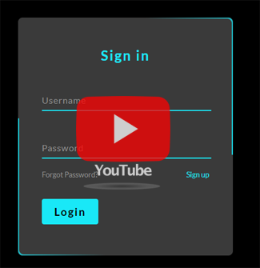
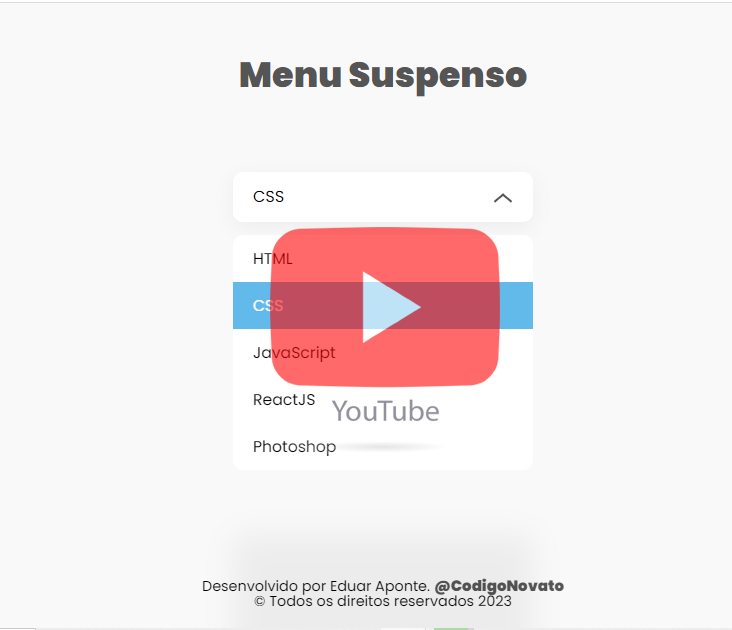

<!-- Readme Typing SVG -->

##
<!-- Redes Sociais -->

 
<!-- Status no Git -->

<!-- Tecnologia do dia a dia  -->

## Tecnologias que uso no meu dia

 
<!-- Medidor de Tecnologias -->

<!-- Ultimos acontecimentos -->

## Últimos video:
- [Canal @codigonovato](https://www.youtube.com/channel/UCQmEVT0Cj2UsqLdjZJzQ-FA)

    

        
        
Como Fazer um Cartão com Efeito Animado

    

    

        
        
Como fazer um Formulário de login animado

    

    

        
        
Como fazer Menu Suspenso Usando HTML CSS e Javascript

    

 
<!-- contador de visitas -->

     
<b>Visitors Count</b>
  
    

 
     

<!-- Footer -->

